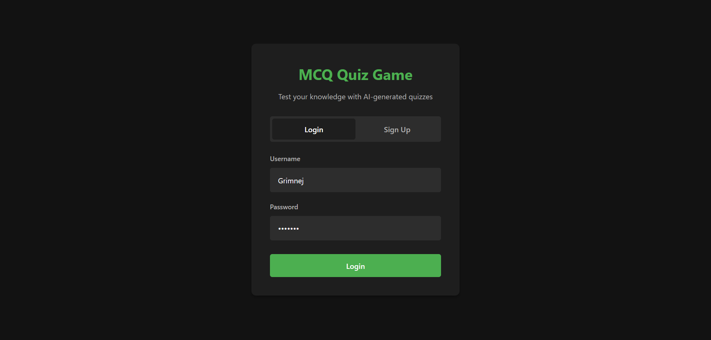
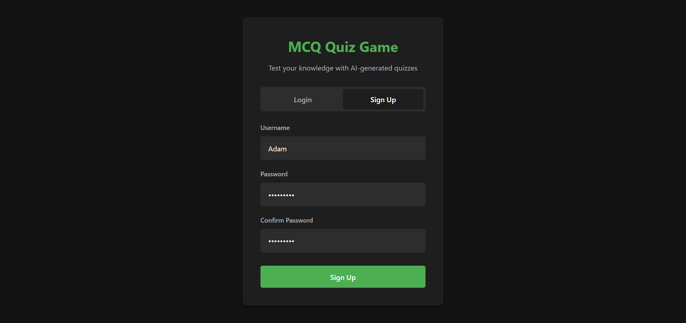
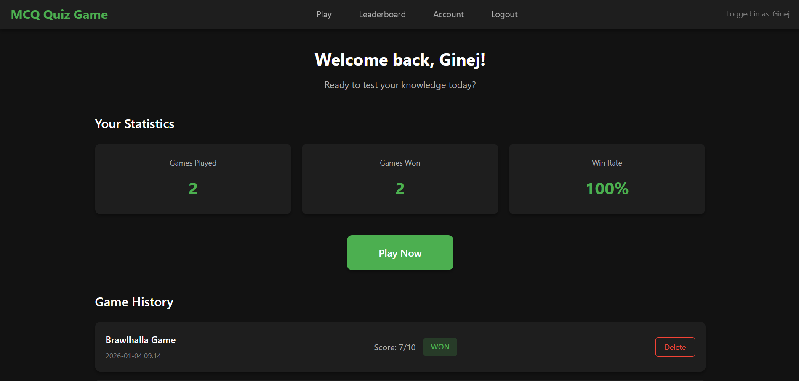
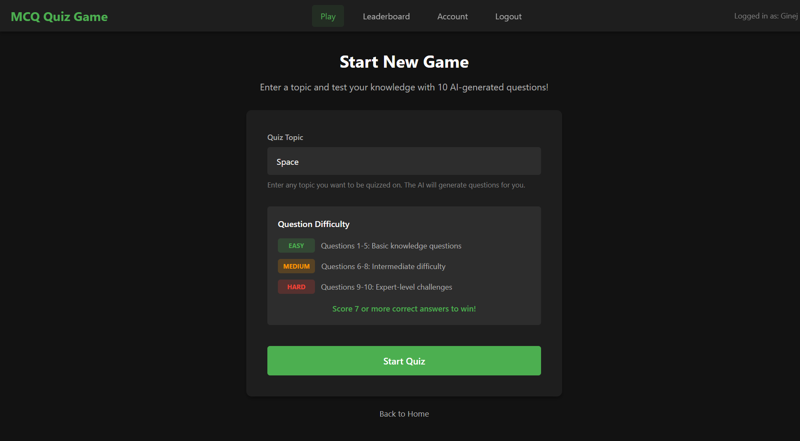
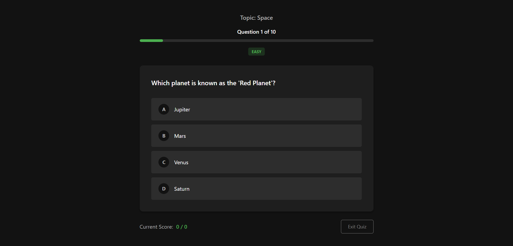
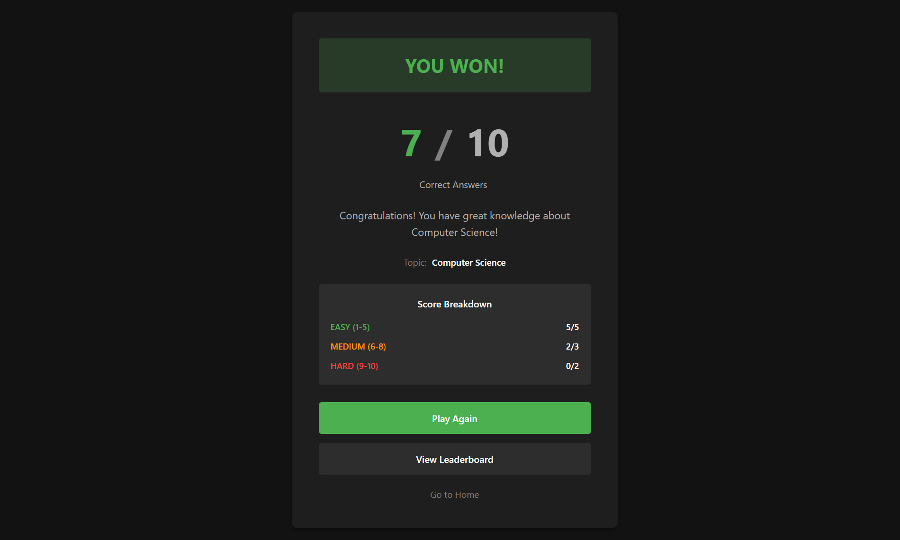
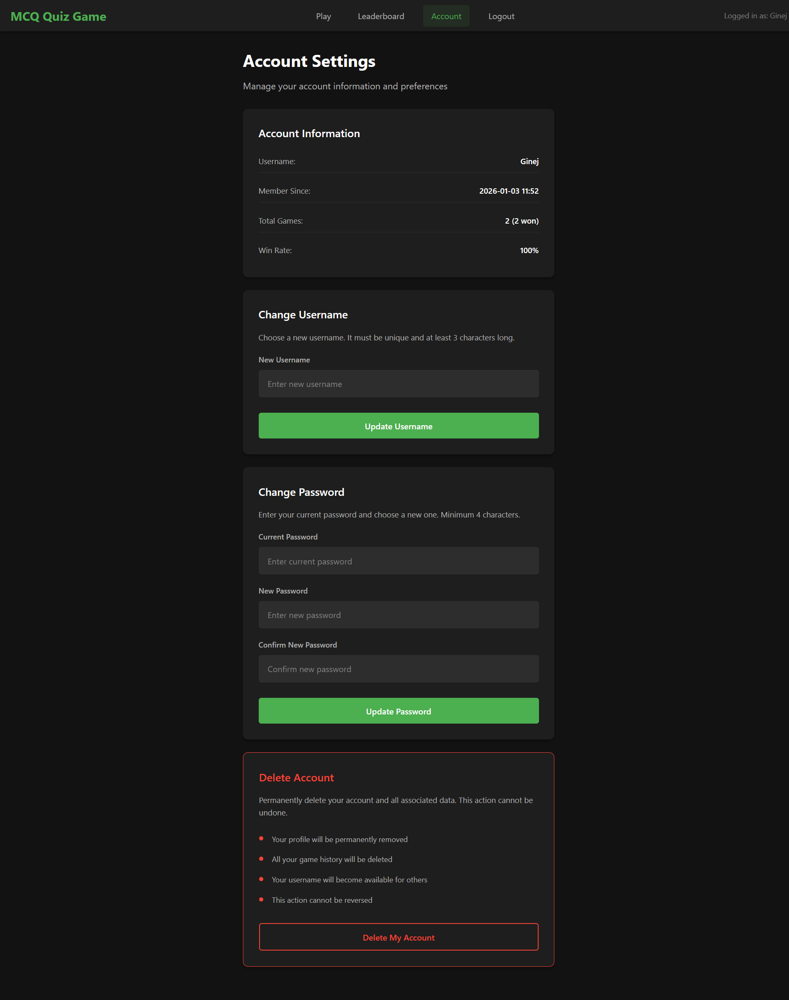

# LLM Integrated MCQ Quiz Game

A fun web based quiz game that tests your knowledge on any topic you choose. The questions are generated by AI (Gemini LLM), so every game is unique!

---

## What is This Project?

MCQ Quiz Game is a simple web application where you can:

- Create an account and track your progress
- Play quizzes on any topic you want (like "Space", "Football", "Python Programming", etc.)
- Answer 10 multiple choice questions per game
- See your scores and compete with other players on the leaderboard

The cool part? The questions are created by Google's Gemini AI. So you can pick ANY topic and get fresh questions every time you play.

---

## How Does It Work?

1. **Sign up** for an account
2. **Choose a topic** you want to be quizzed on
3. **Answer 10 questions** - they get harder as you go:
   - Questions 1-5: Easy
   - Questions 6-8: Medium
   - Questions 9-10: Hard
4. **Score 7 or more** to win the game
5. **Check the leaderboard** to see how you compare with others

---

## What Can You Do?

| Feature | Description |
|---------|-------------|
| Play Quiz | Answer AI-generated questions on any topic |
| Track Stats | See your total games, wins, and win rate |
| Game History | View all your past games and scores |
| Leaderboard | Compete with other players |
| Account Settings | Change username, password, or delete account |

---

## Screenshots

*Login Page - Where you Log in from*


---
*SignUp Page - Where you create an account if you don't have one*



---
*Home Page - See your stats and game history*



---

*Play Page - Pick a topic of your interest for the MCQ Quiz*



---
*Quiz Page - Answer questions and test your knowledge*


---
*Results Page - See how well you did*



---
*Account Page - Make Changes to your Account*



---

## Built With

This project uses simple and beginner-friendly technologies:

**Frontend:**
- HTML - Page structure
- CSS - Styling (dark theme)
- JavaScript - Interactive features

**Backend:**
- Python - Programming language
- Flask - Web framework

**Database:**
- MySQL - Stores user accounts and game history
- XAMPP - Runs the MySQL server

**AI:**
- Google Gemini API - Generates quiz questions

---

## Project Structure

Here is what the project looks like:
```sh
mcq_quiz_game/
|
|-- app.py
|-- database.py
|-- mcq_generator.py
|-- database.sql
|-- .env (create this with your GOOGLE_API_KEY)
|
|-- Markdown/
|   |-- Screenshot.Login-Page.png
|   |-- Screenshot.Home-Page.png
|   |-- Screenshot.Account-Page.png
|   |-- Screenshot.Quiz-Page.png
|
|-- static/
|   |-- css/
|   |   |-- style.css
|   |-- js/
|       |-- script.js
|
|-- templates/
    |-- login.html
    |-- home.html
    |-- play.html
    |-- quiz.html
    |-- results.html
    |-- leaderboard.html
    |-- account.html
```
